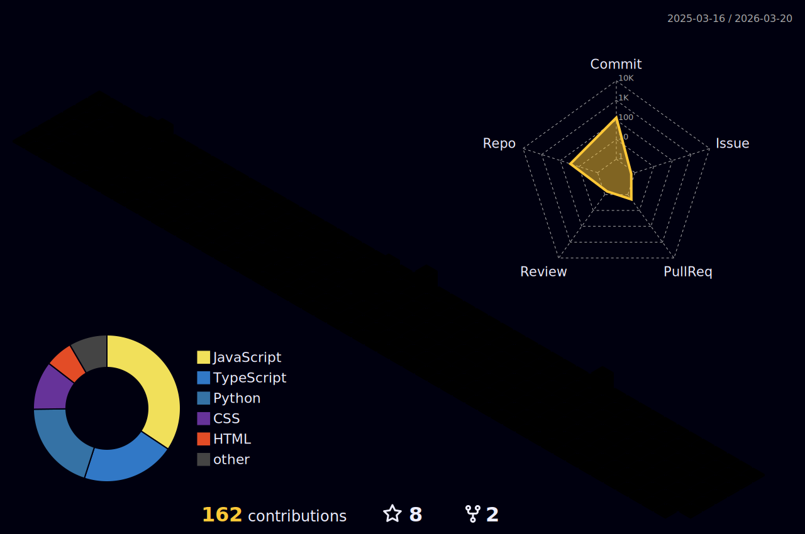

<h1 align="center" style="color: #EB9326">Lizandra Ribeiro Gomes Placido dos Santos</h1>

Estudante de Ciência da Computação   Focada em Desenvolvimento de Soluções Eficientes e Inovadoras

<h2 align="center"> 🔌Conecte-se comigo / Connect with me </h2>

  
  
  

<h3 align="center">Sobre mim</h3> 

🔹 Meu fascínio pela programação começou em 2013, na Khan Academy, quando me deparei com animações em JavaScript. Esse foi o primeiro passo em uma jornada contínua de aprendizado e paixão pela tecnologia. 

🔹 Atualmente, sou sub-gestora na maior rede de farmácias da América Latina, enquanto estudo programação com o objetivo de fazer uma transição para a área de tecnologia.

🔹 A inteligência artificial me fascina pela sua capacidade de criar soluções inovadoras e disruptivas. Meu objetivo é me especializar nessa área e colaborar com pessoas criativas e inovadoras.

🔹 Sou movida pela curiosidade e adoro a sensação de descobrir e dominar novas habilidades. Cada aprendizado é uma nova conquista!

<h2 align="center"> ⚒️ Habilidades / Hard Skills</h2>

|  |  |  |  |
|---|---|---|---|
|  |  |  |  |
|  |  |  |  |
|  |  |  |   |

